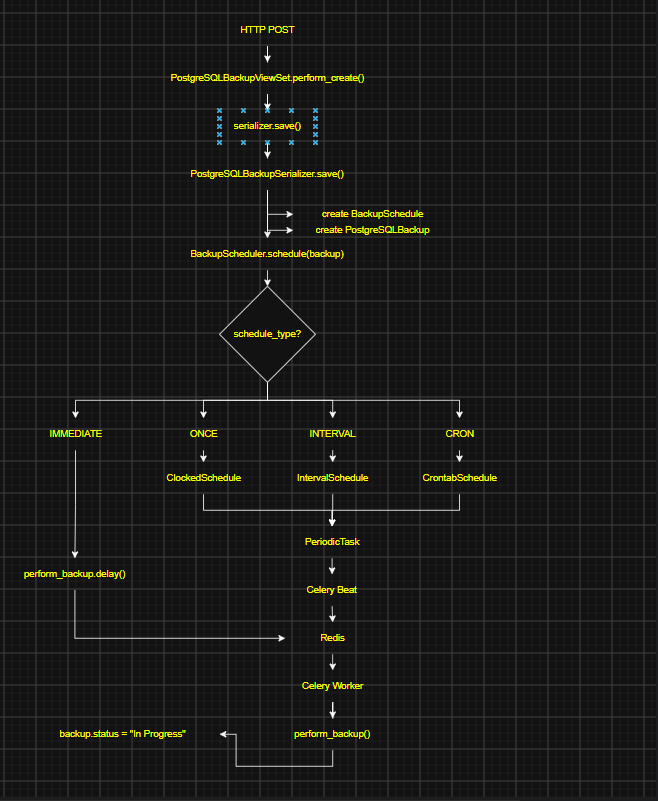

# PAGE 10

## time: 27.07.2026, 12:37 EET 

Today is an important day. Today I managed to use the Celery Beat at its maximum capacity. I managed to schedule the 
following kind of tasks:

- immediate (the backup is performed now)
- once (the backup is scheduled in a dedicated future moment and is executed once)
- interval (the backup is scheduled every x seconds/minutes/hours/days/weeks/months)
- cron (takes a cron expression and schedules a regular task)

To do that, I changed my architecture in order to have the flow displayed on Figure 1. 

   
  <em>Figure 1: Backup Scheduling Flow Using Celery Beat</em>

The **Figure 1** depicts the flow of a POST request that creates an `IMMEDIATE` or a `SCHEDULED` backup.

1) Everything starts with the HTTP POST request. 

2) We override the `perform_create()` method of the `PostgreSQLBackupViewSet` to deal with the 
`PostgreSQLBackupSerializer` (we are just calling the `save()` method of the serializer which is standard for deciding 
if we `create()` or `update()` model instances) and we are calling the `schedule()` method of the 
`BackupScheduler` class so that we can schedule accordingly the recently created entry inside our Django DB 
(SQLite3 database).  

This is the flow: `perform_create()` -> `save()` -> `create()` or `update()`

3) Before we create the new entry inside the `PostgreSQLBackup` table, we have to create another entry inside the 
`BackupSchedule` which pretty much represents the type of schedule (the data representation) we want to actually 
schedule using `Celery Beat`, inside one of the methods of the `BackupScheduler` class.  

    That is why we have overwritten the `create()` method of the `PostgreSQLBackupSerializer` class...to ensure that we 
firstly create the `BackupSchedule` entry and then create the `PostgreSQLBackup` entry. The relation between them is 
`1-to-1` and a PostgreSQLBackup entry cannot exist without a `BackupSchedule` reference.

4) After we created the `PostgreSQLBackup` entry, we must actually schedule that backup based on the data inserted in 
the `SQLite3` database. To schedule the backup, we use the `BackupScheduler` class. There we make the distinction (based 
on the data we saved inside the `BackupSchedule` table) between an `IMMEDIATE` backup or a `SCHEDULED` backup (we use 
the `schedule_type` attribute).

5) If we are dealing with an `IMMEDIATE` backup, we simply call `perform_backup.delay(backup.id)`. The `delay()` is the 
actual way we put the task inside the `Redis` (the broker) in-memory database and from there it is executed by the 
Celery worker. This is how we create an asynchronous task and `return immediately to the HTTP client`.

6) If we have a `SCHEDULED` task, we make the distinction between the following types of schedules:
   - ONCE 
   - INTERVAL
   - CRON

    There are 3 more important models that we need to migrate inside our `SQLite3` database we have to talk about. These 
models (defined inside `django_celery_beat.models`) are:
   - ClockedSchedule
   - IntervalSchedule
   - CrontabSchedule

    These models represent different scheduling strategies referenced by `PeriodicTask`

    To create a one-time (also named `one_off`) future scheduled backup, I created a `ClockedSchedule` entry inside the 
Django database which I used to create a `PeriodicTask` (also stored inside the `SQLite3` database) which is later
transferred by the `Celery Beat` into `Redis` and from where it is executed by Celery worker.
    
    The same applies to the other types of schedules:
   - To create an `INTERVAL` schedule, I used `IntervalSchedule` model which was later used to create a `PeriodicTask`
   - To create an `CRON` schedule, I used `CrontabSchedule` model which was later used to create a `PeriodicTask`

7) Celery Beat polls the Django database periodically to detect newly created or modified `PeriodicTask` objects. It 
loads them and decides if they are due. In that case, the `PeriodicTask` is published into `Redis`.

## My view: 

1) The thing is that I did not want to create a `ViewSet` for `BackupSchedule` as I do not see the 
sense of creating HTTP requests to access the BackupSchedule table inside the database and create general schedules for 
all PostgreSQLBackups. I wanted to have a more granular approach: one schedule for one backup for one PostgreSQL 
instance. Maybe in the future I will create some generic scheduled backups and apply them to a group of instances...
We'll see...

## Problems encountered

The `BackupScheduleSerializer` originally inherited from `serializers.HyperlinkedModelSerializer`.

Since `BackupSchedule` is an internal implementation detail and is not exposed through the REST API, no 
`BackupScheduleViewSet` was registered with the router.

As a result, DRF attempted to resolve the backupschedule-detail endpoint when serializing `BackupSchedule` objects,
raising the following exception:

`Could not resolve URL for hyperlinked relationship...`

Replacing `HyperlinkedModelSerializer` with `ModelSerializer` removed the requirement to generate hyperlinks while 
preserving the desired API behavior.

## Validation

The implementation was validated by successfully executing:

- Immediate backup
- One-off scheduled backup
- Interval scheduled backup
- Cron scheduled backup

Each scheduling strategy correctly created the corresponding Celery Beat
objects and resulted in the successful execution of the perform_backup task.
